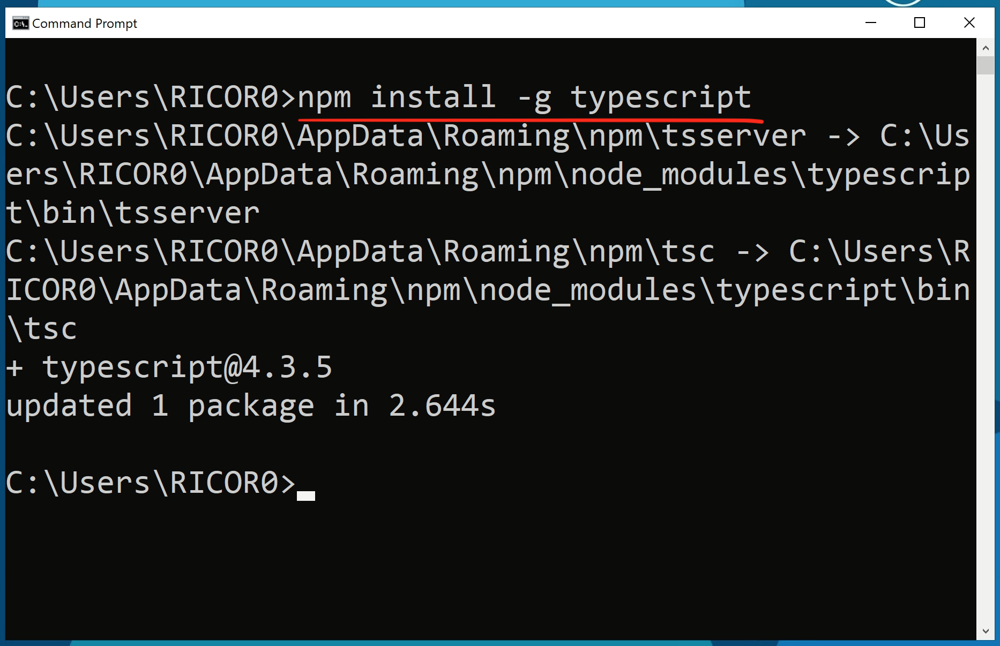
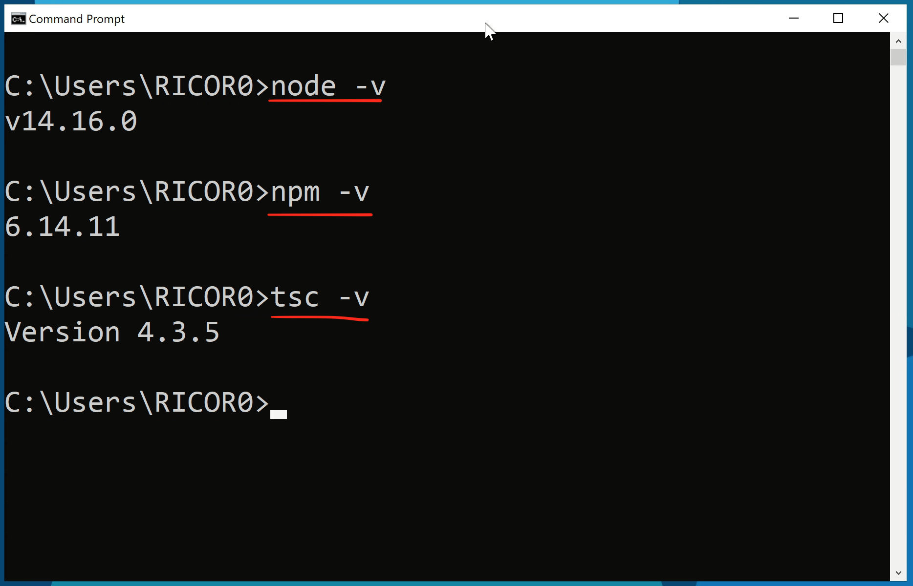

## Install Node.js

Download the Node.js source code or a pre-built install 

[https://nodejs.org/en/download/](https://nodejs.org/en/download)

## Install TypeScript
Execute the command below in your computer terminal/command prompt:

`npm install -g typescript`

 
 
 

To check the version running on your computer or verify your installation, execute the commands below in your computer terminal/command prompt:

 
 

### Check Node.js version
`node -v`

and the package manager

`npm -v`
 
 

### Check TypeScript version
`tsc -v`
 
 
 

## Install Visual Studio Code

Download and install Visual Studio Code

[https://code.visualstudio.com/](https://code.visualstudio.com/)